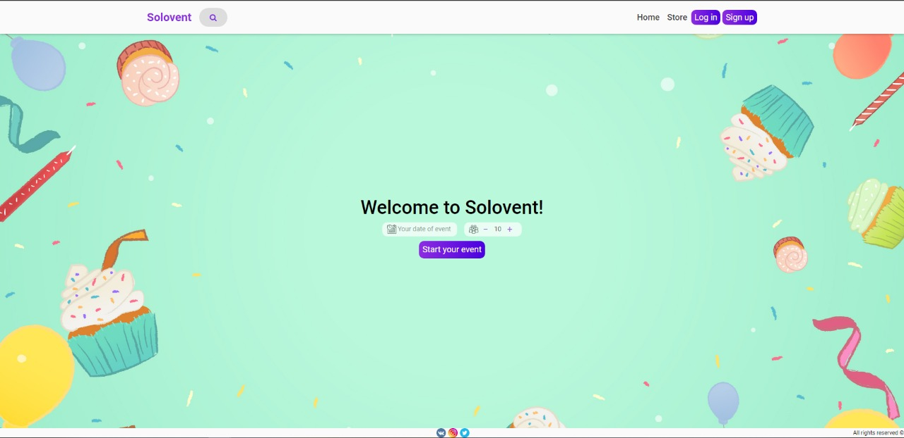

# Solovent
Service for the provision of services for various events

## Install
- clone repository
- install all dependencies from file __requirements.txt__:
  ```shell
  pip install -r requirements.txt
- go to the directory with the file __manage.py__
- start the server with the command:
  ```shell
  python manage.py runserver
- standard server address **127.0.0.1:8000**
  
